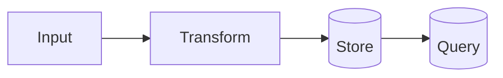

# Math and diagrams

Delete this page once real notes exist. It proves the toolchain works.

## Inline and block math

KaTeX via `remark-math` + `rehype-katex`. Inline: $e^{i\pi} + 1 = 0$.

Block:

$$
\int_{-\infty}^{\infty} e^{-x^2}\,dx = \sqrt{\pi}
$$

## Diagrams

Mermaid via `@docusaurus/theme-mermaid`.

## Admonitions

:::tip
Front matter `tags` groups pages across folders at `/docs/tags`.
:::
